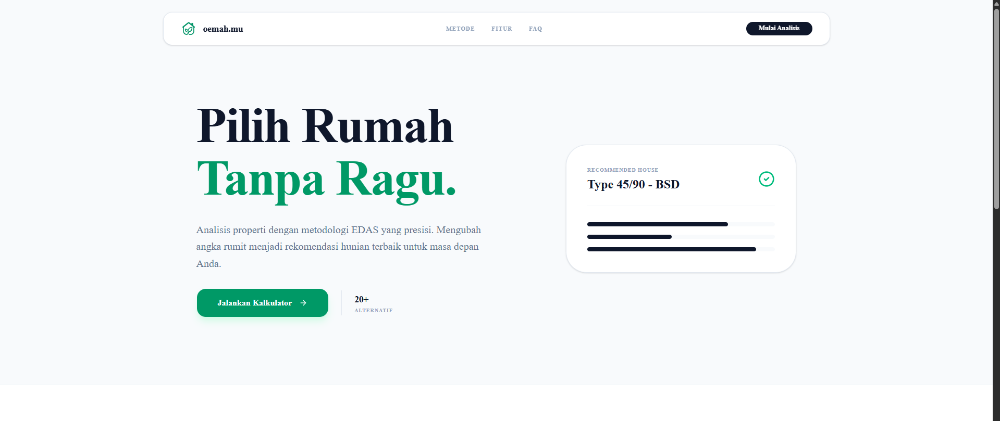
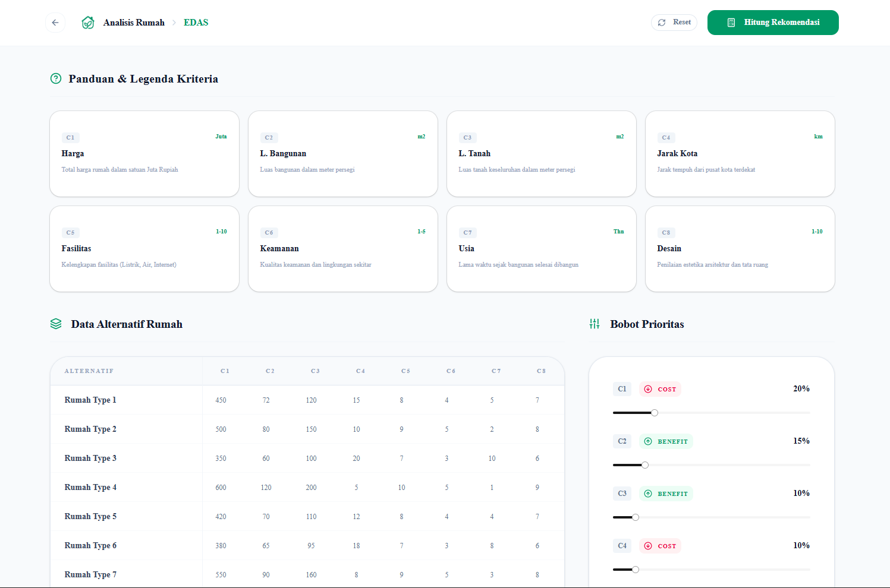
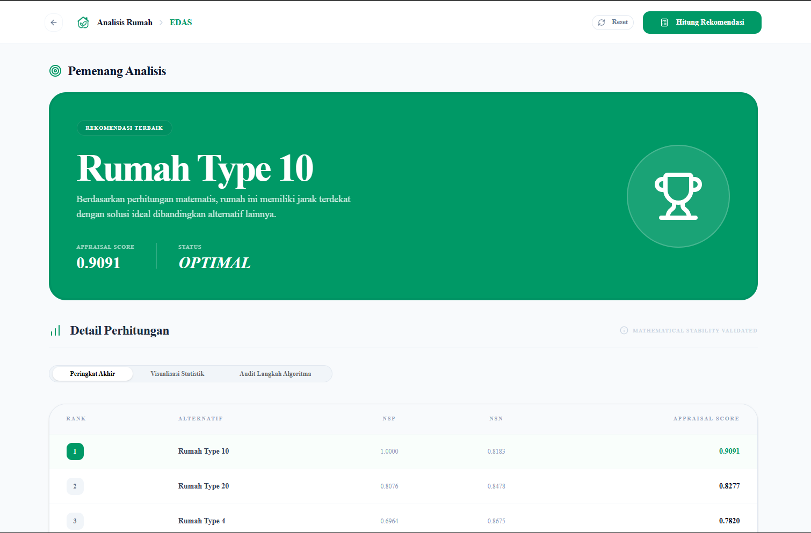

# oemah.mu - Decision Support System for Property Selection


**oemah.mu** adalah platform berbasis web (Software as a Service) yang dirancang untuk mendukung pengambilan keputusan pemilihan hunian secara objektif. Sistem ini mengimplementasikan metode matematika **EDAS (Evaluation Based on Distance from Average Solution)** untuk melakukan pemeringkatan alternatif properti berdasarkan kriteria yang dapat disesuaikan.

## System Preview

| Landing Page | Calculator Dashboard | Analytical Results |
| :---: | :---: | :---: |
|  |  |  |

## Teknologi Utama

### Frontend
- Framework: Next.js 15 (App Router)
- Styling: Tailwind CSS
- UI Components: Shadcn UI & Lucide React
- Visualisasi: Recharts
- State Management: React Hooks

### Backend
- Framework: FastAPI (Python)
- Computation: NumPy
- Data Validation: Pydantic
- Architecture: RESTful API

## Metodologi
Sistem ini mengandalkan algoritma **EDAS** yang berfokus pada jarak alternatif terhadap solusi rata-rata (Average Solution). Pendekatan ini sangat efektif dalam menangani situasi di mana kriteria keputusan saling bertentangan.

Tahapan Kalkulasi:
1. Perhitungan Solusi Rata-rata (AV) per kriteria.
2. Perhitungan Positive Distance from Average (PDA).
3. Perhitungan Negative Distance from Average (NDA).
4. Perhitungan Weighted Sum PDA (SP) dan NDA (SN).
5. Normalisasi nilai SP (NSP) dan SN (NSN).
6. Kalkulasi Appraisal Score (AS) akhir.

## Fitur Sistem
- Kapasitas analisis hingga 20+ alternatif rumah secara simultan.
- 8 Kriteria keputusan (Harga, Luas, Jarak, Fasilitas, Keamanan, Usia, Desain).
- Manajemen bobot kriteria dinamis dengan slider interaktif.
- Dashboard hasil analisis dengan grafik statistik.
- Audit transparansi langkah perhitungan algoritma.

## Struktur Direktori
```text
.
├── frontend/        # Aplikasi Client (Next.js)
│   ├── app/         # Struktur Routing & Layout
│   ├── components/  # Komponen UI Modular
│   └── public/      # Aset Statis & Branding
├── backend/         # Aplikasi Server (FastAPI)
│   ├── app/         # Definisi Router API
│   ├── engine.py    # Logika Matematika EDAS
│   └── models.py    # Skema Data Pydantic
└── README.md
```

## Panduan Instalasi

### Backend
1. Navigasi ke direktori backend: `cd backend`
2. Instalasi dependensi: `pip install -r requirements.txt`
3. Eksekusi server: `uvicorn app.main:app --reload`

### Frontend
1. Navigasi ke direktori frontend: `cd frontend`
2. Instalasi dependensi: `npm install`
3. Eksekusi aplikasi: `npm run dev`
4. URL Akses: `http://localhost:3000`

---
© 2026 EDAS.rumah Project - Mathematical Accuracy Guaranteed.
